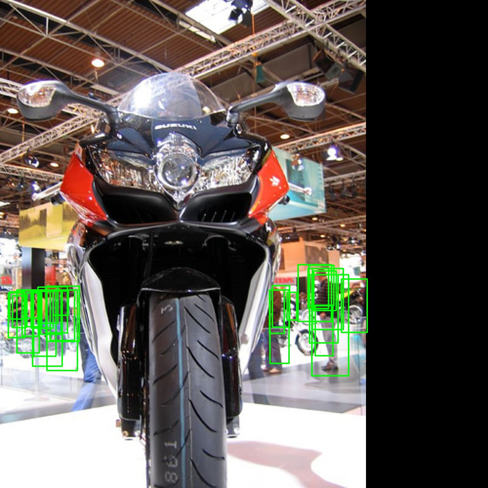

# week 4

## 이번 주 작업

### ● rpn에서의 process를 바꿈.
  

### ● training
```
- 기존 : anchor → bbox regression → labeling → sampling → loss → backward
- 바꾼 : anchor → select top k → bbox regression → NMS → labeling → sampling → loss → backward
```

### ● evaluation
```
- 기존 : anchor → bbox regression → score threshold → NMS → RoI
- 바꾼 : anchor → select top k → bbox regression → NMS → "score threshold" or "select top N" → RoI
```

### ● 바꾸면서 코드 구조를 좀 더 체계적으로 바꿈.

### ● critical한 bug 수정
- 정해진 수의 training sample 고를 때 image 별로 안 고르고 batch에서 고름.
- box regression의 loss를 구할 때 box regression을 하고 난 anchor로 구했었음.
- labeling할 때 nms에서 걸러진 anchor에서 가장 IoU가 높은 것으로 구해야하는데 nms로 거르기 전 anchor들도 포함되어 있었음.
- 하나의 gt_bbox와 가장 IoU가 높은 anchor를 구할 때, gt_bbox tensor의 pad도 실제 anchor로 생각하여 계산 했었음.

## Region proposal (val2017 image 120개)

Ground Truth | Region Proposal
:-------:|:-----------:
 | 
 | 
 | 
 | 
 | 
 | 
 | 
 | 
 | 
 | 

---

## Human detection (train2017)

- 어제 22:30 ~ 오늘 13:30 까지 (15h) 6epoch를 돌린 결과를 val2017 앞의 10개 이미지 테스트

Ground Truth(human) | Region Proposal(human)
:-------:|:-----------:
 | 
 | 
 | 
 | 
 | 
 | 
 | 
 | 
 | 
 | 

---

## 질문 사항

- smooth_L1_loss

DataParallel을 쓰는 경우 gt가 없는 이미지가 발생 -> 이런 경우는 loss를 0.0을 채움  
smooth_L1_loss은 loss의 최소값이 -0.5인데 어떻게 해야하는가.


- training log 출력. 어떤 내용?

- evaluation 함수: precision만? batch 별로?

---

## 현재 버그
- anchor와 loss를 구할 gt를 정하는 곳에 버그가 있음.(가장 높은 IoU)

## TODO

- 이번 주까지 목표
    - [ ] human detection precision 뽑아내기

    - [ ] RoIPooling 추가
    - [ ] classification network (box head)

    - [ ] Timer, logger 만들기
    - [ ] evaluation 함수 만들기
    - [ ] human detection AP 구하기 (coco api)

    - [ ] opencv affine transformation 만들기

    - [ ] RoIPooling 추가
    - [ ] classification network (box head)

- 다음 주까지 목표

---

- 차후
    - [ ] fpn debug w/o box regression
    - [x] fpn을 위한 rpn 함수 구조 체계화
    - [ ] 시간 측정
    - [ ] fpn debug
    - [ ] fpn에서 region proposal의 heuristic method 적용
    - [ ] RoIAlign 추가
    - [ ] box head의 box regression loss와 class loss
    - [ ] box head에서의 heuristic method를 적용
    - [ ] training 


