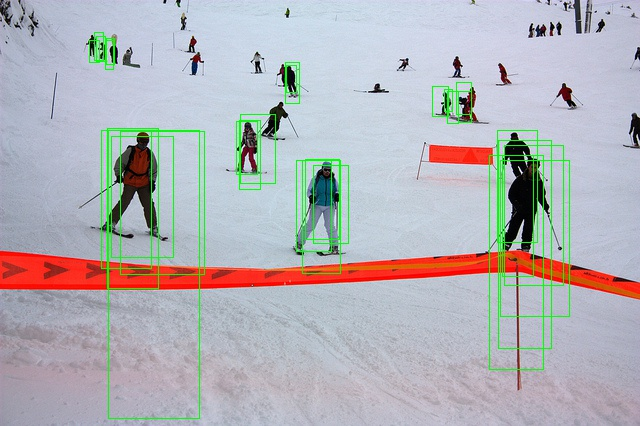

# week 6

## 이번 주 작업

### detectron 2 code copy

- 세부 알고리즘 수정

### 기존
score_threshold : 0.5, nms_threshold : 0.7  

Average Precision  (AP) @[ IoU=0.50:0.95 | area=   all | maxDets=100 ] = 0.036  
Average Precision  (AP) @[ IoU=0.50      | area=   all | maxDets=100 ] = 0.140  
Average Precision  (AP) @[ IoU=0.75      | area=   all | maxDets=100 ] = 0.005  
Average Precision  (AP) @[ IoU=0.50:0.95 | area= small | maxDets=100 ] = 0.030  
Average Precision  (AP) @[ IoU=0.50:0.95 | area=medium | maxDets=100 ] = 0.060  
Average Precision  (AP) @[ IoU=0.50:0.95 | area= large | maxDets=100 ] = 0.043  
Average Recall     (AR) @[ IoU=0.50:0.95 | area=   all | maxDets=  1 ] = 0.036  
Average Recall     (AR) @[ IoU=0.50:0.95 | area=   all | maxDets= 10 ] = 0.112  
Average Recall     (AR) @[ IoU=0.50:0.95 | area=   all | maxDets=100 ] = 0.177  
Average Recall     (AR) @[ IoU=0.50:0.95 | area= small | maxDets=100 ] = 0.087  
Average Recall     (AR) @[ IoU=0.50:0.95 | area=medium | maxDets=100 ] = 0.238  
Average Recall     (AR) @[ IoU=0.50:0.95 | area= large | maxDets=100 ] = 0.235  

### 사진

images | images
:-------:|:-----------:
 | 
 | 
 | 
 | 
 | 

### 문제점
- bbox regression 문제

## 질문 사항

---

## 현재 버그
- anchor와 loss를 구할 gt를 정하는 곳에 버그가 있음.(가장 높은 IoU)

## TODO

- 이번 주까지 목표
    - [x] opencv transformation matrix
    - [x] get prediction on original images
    - [x] result out as coco format file

    - [x] human detection precision 뽑아내기

    - [ ] RoIPooling 추가
    - [ ] classification network (box head)

    - [ ] Timer, logger 만들기
    - [x] evaluation 함수 만들기
    - [x] human detection AP 구하기 (coco api)

---

3 : sample 256, weight 0.1, constrain : 0.3, 2