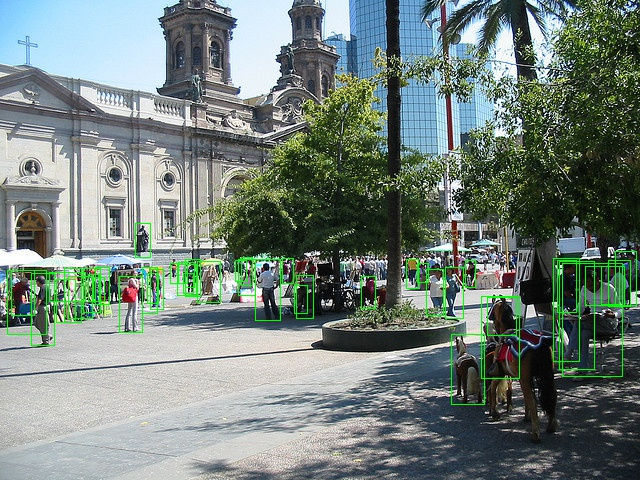
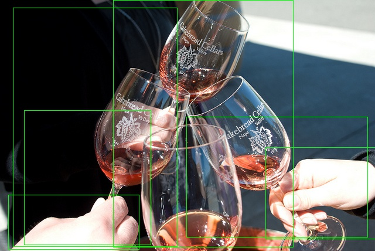

# week 8

## 수정 사항

### 중요 수정 사항
- roi_head layer 만듬
- roi align은 torchvision의 roi_align() 함수를 사용. (detectron2에서 사용하고 있는 RoIAlignV2(위치가 정확하게 보정된)를 사용)
- loss 구하는 logic 함수들은 RPN에서 사용하던 함수를 수정하여 사용.

### 안중요 수정 사항
- backbone에서 학습시키지 않는 영역의 require_grad를 False를 안 시켜줌 (메모리 낭비)
- warmpup scheduler를 만들었는데, 아직 사용 X
- RPN에서 재탕할 때, labeling 함수에서 가장 IOU를 높은 것은 무시하고 무조건 threshold로 함.
- detectron2의 heuristic 방법인 proposal에 gt_bbox를 넣어줌.
- roi_align에서의 중요한 버그들을 수정함
- 1 proposals를 feature map에 맞게 mapping을 안 시켜줬었음.
- 2 xyxy좌표를 넣어줘야하는데, xywh 좌표를 넣어줌.
- 3 box clipping 후 width or height가 0인 proposal들에 대한 처리가 없었음.

## Result

- 일단 epoch 4에서는 regression의 효과는 매우 잘 되는 것 같다. 근데 AP 성능이 그냥 떨어짐.
- 실제 human이 아닌 것이나 주변 hard negative들도 human으로 인식함.
- loss balance가 잘 안 맞는 것이 원인으로 생각하여 roi_head regression loss weight을 조금 줄이고 다시 실험 중
- detectron2의 코드를 좀 더 보거나 실제로 학습을 돌려봐서 loss 값을 비교해볼 예정.

| 종류 |    IoU    |  area  |maxDets| w/o roi_head (last week) | w/ roi_head |
|:----:|:---------:|:------:|:-----:|:------------------------:|:-----------:|
|  AP  | 0.50:0.95 |  all   |  100  |           0.311          |    0.245    |
|  AP  | 0.50      |  all   |  100  |           0.657          |    0.434    |
|  AP  | 0.75      |  all   |  100  |           0.254          |  __0.250__  |
|  AP  | 0.50:0.95 | small  |  100  |           0.218          |    0.105    |
|  AP  | 0.50:0.95 | medium |  100  |           0.474          |    0.335    |
|  AP  | 0.50:0.95 | large  |  100  |           0.329          |  __0.372__  |
|  AR  | 0.50:0.95 |  all   |   1   |           0.119          |  __0.125__  |
|  AR  | 0.50:0.95 |  all   |   10  |           0.363          |    0.327    |
|  AR  | 0.50:0.95 |  all   |  100  |           0.407          |    0.350    |
|  AR  | 0.50:0.95 | small  |  100  |           0.268          |    0.148    |
|  AR  | 0.50:0.95 | medium |  100  |           0.535          |    0.439    |
|  AR  | 0.50:0.95 | large  |  100  |           0.451          |  __0.548__  |

## Result

| 종류 |    IoU    |  area  |maxDets| value |
|:----:|:---------:|:------:|:-----:|:-----:|
|  AP  | 0.50:0.95 |  all   |  100  | 0.395 |
|  AP  | 0.50      |  all   |  100  | 0.630 |
|  AP  | 0.75      |  all   |  100  | 0.424 |
|  AP  | 0.50:0.95 | small  |  100  | 0.165 |
|  AP  | 0.50:0.95 | medium |  100  | 0.508 |
|  AP  | 0.50:0.95 | large  |  100  | 0.606 |
|  AR  | 0.50:0.95 |  all   |   1   | 0.166 |
|  AR  | 0.50:0.95 |  all   |   10  | 0.421 |
|  AR  | 0.50:0.95 |  all   |  100  | 0.439 |
|  AR  | 0.50:0.95 | small  |  100  | 0.184 |
|  AR  | 0.50:0.95 | medium |  100  | 0.557 |
|  AR  | 0.50:0.95 | large  |  100  | 0.682 |

## Proposal images

| img | img |
|:---:|:---:|
|  |  |
|  |  |
|  |  |
|  |  |
|  |  |
|  |  |
|  |  |
|  |  |
|  |  |
|  |  |
|  |  |
|  |  |
|  |  |
|  |  |
|  |  |
|  |  |
|  |  |
|  |  |
|  |  |
|  |  |
|  |  |
|  |  |
|  |  |
|  |  |
|  |  |
|  |  |
|  |  |
|  |  |
|  |  |
|  |  |
|  |  |
|  |  |
|  |  |
|  |  |
|  |  |
|  |  |
|  |  |
|  |  |
|  |  |
|  |  |

# Question
